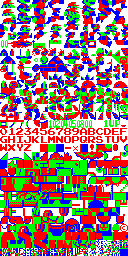

# nes

[](http://godoc.org/github.com/bakerolls/nes)
[](https://goreportcard.com/report/github.com/bakerolls/nes)

Package nes registers a custom image format for reading NES ROMs. After importing it with `_` you can use `image.Decode` to decode a roms sprites into an `image.Image`.



#### Examples

##### Decode

Decode reads a NES ROM and returns it as an image.Image.

```golang
package main

import (
	"fmt"
	"image"
	"log"
	"os"

	_ "github.com/bakerolls/nes"
)

func main() {
	// This rom file does not contain any game logic.
	r, err := os.Open("testdata/super_mario_bros_sprites.nes")
	if err != nil {
		log.Fatal(err)
	}
	defer r.Close()
	_, format, err := image.Decode(r)
	if err != nil {
		log.Fatal(err)
	}
	fmt.Println(format)
}

```
